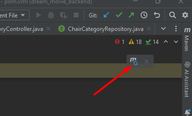
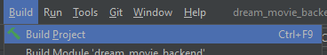
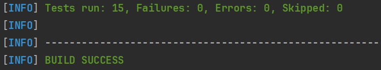

# Cấu trúc của backend:

## pom.xml: File cấu hình Maven
- Chứa các dependency cần thiết cho project. (Giống như package.json của NodeJS)
- Sử dụng để quản lý các thư viện cần thiết cho project, có thể thêm, xóa, sửa các thư viện thông qua file này.
- Chạy lệnh `mvn clean install` để cài đặt các thư viện cần thiết cho project.

## src/main/java: Thư mục chứa mã nguồn Java

### Main.java: File chứa hàm main của project
- Chứa hàm main để chạy project.
- Trong hàm main, chính là nơi chúng ta sẽ khởi tạo Spring Boot Application và chạy ứng dụ

## application.properties: File cấu hình cho ứng dụng
- Chứa các cấu hình cho ứng dụng như cấu hình cổng(Chạy localhost ở cổng nào), cấu hình kết nối với database(kết nối với local database nào), cấu hình các file tĩnh, cấu hình các thông số khác của ứng dụng.

# Cách mà Spring Boot backend hoạt động:
- Lấy ví dụ về xử lý API cho phim, ta tạo 1 folder films trong src/main/java/com/dreamovie
- Trong folder films, tạo 3 file FilmController.java, FilmService.java, FilmRepository.java, Film.java

## Film.java: File chứa model(đối tượng) của phim
- Chứa các thuộc tính của phim như id, tên phim, thể loại, ...
- Chứa các hàm getter, setter để lấy và gán giá trị cho các thuộc tính của phim.

## FilmRepository.java: File chứa interface để tương tác với database bằng các phương thức của JpaRepository (CRUD - Create, Read, Update, Delete)
- Kế thừa interface JpaRepository<Film, ...> để thực hiện các thao tác với database như thêm, sửa, xóa, lấy thông tin phim.
- List<Film> findByDeletedAtIsNull(): Phương thức của interface, lấy danh sách phim chưa bị xóa.

## FilmService.java: File chứa các hàm xử lý logic của phim
- File này chứa các hàm xử lý logic của phim như thêm phim, sửa phim, xóa phim, lấy danh sách phim, ...
- Sử dụng FilmRepository để thực hiện các thao tác với database.

## FilmController.java: File chứa các hàm xử lý API cho phim
- Định nghĩa đường dẫn API, phương thức HTTP(GET, POST, PUT, DELETE) từ front-end và gọi các hàm xử lý logic của phim trong FilmService.
- Trả về kết quả cho front-end.

## Main.java: File chứa hàm main của project
- Chạy Spring Boot Application và cấu hình tại file application.properties.

# Các bước chạy Unit Test:
## Cấu hình thư viện pom.xml
- Thêm các dependence sau vào file pom.xml để cài đặt thư viện cần thiết cho unit test

      Cài đặt thư viện thực hiện các unit test-->
        <dependency>
            <groupId>org.springframework.boot</groupId>
            <artifactId>spring-boot-starter-test</artifactId>
            <scope>test</scope>
        </dependency>

        <dependency>
            <groupId>org.mockito</groupId>
            <artifactId>mockito-core</artifactId>
            <scope>test</scope>
        </dependency>

- Thực hiện refresh cho pom sau khi có thay đổi

- Build dự án sau khi thêm dependence
- 

- Chạy lệnh sau để thực hiện cài đặt thư viện
- `mvn clean install` 
- Vào thư mục test > com.dreammovie thêm folder unit_test
- Tạo folder cho đối tượng bạn muốn thực hiện sinh unit test
- Tạo các file Repository, controller, service để thực hiện test cho từng chức năng
- Nếu mới bắt đầu bạn cũng có thể tạo 1 file để làm quen, việc chia thành các file không phải bắt buộc, việc đó là giúp cho bạn có thể dễ dàng hơn trong việc mở rộng unit test và dễ bảo trì sau này

+ Tại terminal, dùng câu lệnh `mvn test` để thực hiện toàn bộ các unit test bạn đã viết
+ Nếu bạn muốn chỉ test 1 hàm nhất định thì dùng câu lệnh ` mvn -Dtest=( Tên Class (tên file)) #(Tên hàm muốn test) test
+ Ví dụ: ` mvn -Dtest=ChairCategoryServiceTest#testAddChairCategory test`
+ Kiểm tra terminal sau khi test nếu báo như hình là tất cả các test đều hoạt động bình thường

+ Chú ý là lệnh `mvn ... test` chỉ thực hiện những hàm có **Annotation** là **`@Test`**